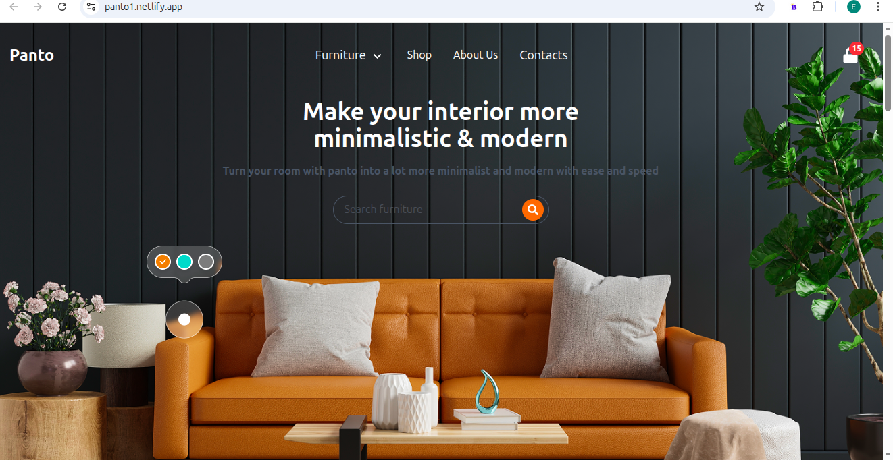

# Portfolio Epiphane Houehanou 

Un portfolio moderne et interactif développé avec Next.js 15, React 19, et Tailwind CSS. Ce site présente mes compétences en développement web, mon expérience professionnelle, et mes services.



## Fonctionnalités

- **Design Moderne** : Interface utilisateur élégante avec animations fluides
- **Responsive** : Optimisé pour tous les appareils (mobile, tablette, desktop)
- **Animations** : Intégration de Framer Motion pour des transitions fluides
- **Formulaire de Contact** : Système de contact fonctionnel avec FormSubmit
- **CV Téléchargeable** : Accès direct au CV en PDF
- **Navigation Intuitive** : Menu de navigation mobile et desktop
- **Performance Optimisée** : Utilisation de Next.js 15 avec Turbopack

## Technologies Utilisées

### Frontend
- **Next.js 15** - Framework React avec App Router
- **React 19** - Bibliothèque JavaScript pour l'interface utilisateur
- **TypeScript** - Typage statique pour JavaScript
- **Tailwind CSS** - Framework CSS utilitaire
- **Framer Motion** - Bibliothèque d'animations

### UI Components
- **Radix UI** - Composants accessibles et personnalisables
- **Lucide React** - Icônes modernes
- **React Icons** - Collection d'icônes populaires
- **Swiper** - Carrousel et slider moderne

### Outils de Développement
- **ESLint** - Linter pour maintenir la qualité du code
- **PostCSS** - Traitement CSS
- **Autoprefixer** - Préfixes CSS automatiques

## Structure du Projet

```
epi/
├── public/                    # Fichiers statiques
│   ├── EpiphaneHouehanou.pdf # CV téléchargeable
│   └── *.png, *.svg          # Images et icônes
├── src/
│   ├── app/                  # Pages de l'application (App Router)
│   │   ├── contact/          # Page de contact
│   │   ├── resume/           # Page CV/Expérience
│   │   ├── services/         # Page des services
│   │   └── page.tsx          # Page d'accueil
│   ├── components/           # Composants réutilisables
│   │   ├── ui/              # Composants UI de base
│   │   ├── Header.tsx       # En-tête du site
│   │   ├── MobileNav.tsx    # Navigation mobile
│   │   ├── Photo.tsx        # Composant photo de profil
│   │   └── ...              # Autres composants
│   └── lib/                 # Utilitaires et helpers
└── Configuration files       # Next.js, Tailwind, TypeScript, etc.
```

## Installation et Démarrage

### Prérequis
- Node.js 18+ 
- npm, yarn, pnpm ou bun

### Installation

1. **Cloner le repository**
```bash
git clone https://github.com/votre-username/portfolio-epiphane.git
cd portfolio-epiphane
```

2. **Installer les dépendances**
```bash
npm install
# ou
yarn install
# ou
pnpm install
```

3. **Lancer le serveur de développement**
```bash
npm run dev
# ou
yarn dev
# ou
pnpm dev
```

4. **Ouvrir dans le navigateur**
Accédez à [http://localhost:3000](http://localhost:3000)

## Scripts Disponibles

```bash
npm run dev        # Démarrer le serveur de développement avec Turbopack
npm run build      # Construire l'application pour la production
npm run start      # Démarrer le serveur de production
npm run lint       # Vérifier la qualité du code avec ESLint
```

## Personnalisation

### Couleurs et Thème
Les couleurs principales sont définies dans `tailwind.config.js`. La couleur d'accent principale peut être modifiée :

```js
// tailwind.config.js
module.exports = {
  theme: {
    extend: {
      colors: {
        accent: '#votre-couleur', // Modifier ici
      }
    }
  }
}
```

### Contenu Personnel
- **Informations personnelles** : Modifier `src/app/resume/page.tsx`
- **Services** : Éditer `src/app/services/page.tsx`
- **Photo de profil** : Remplacer les images dans `public/`
- **CV** : Remplacer `public/EpiphaneHouehanou.pdf`

## Configuration du Formulaire de Contact

Le formulaire utilise FormSubmit.co. Pour configurer votre propre email :

1. Modifier l'URL dans `src/app/contact/page.tsx` :
```typescript
const response = await fetch("https://formsubmit.co/ajax/votre-email@gmail.com", {
  method: "POST",
  body: formDataToSend,
});
```

## Déploiement

### Vercel (Recommandé)
1. Connectez votre repository GitHub à Vercel
2. Vercel détectera automatiquement Next.js
3. Déployez en un clic

### Autres Plateformes
- **Netlify** : Compatible avec les sites statiques Next.js
- **Railway** : Pour les déploiements avec serveur
- **Heroku** : Configuration Docker possible

## Fonctionnalités Principales

### Page d'Accueil
- Présentation personnelle avec animation
- Bouton de téléchargement du CV
- Liens vers les réseaux sociaux
- Statistiques animées

### Page CV/Expérience
- Onglets interactifs (Expérience, Formation, Compétences, À propos)
- Animations au scroll
- Tooltips informatifs pour les compétences

### Page Services
- Présentation des services offerts
- Animations au hover
- Liens vers les projets

### Page Contact
- Formulaire de contact fonctionnel
- Validation côté client
- Messages de confirmation/erreur
- Informations de contact

## Contribution

Les contributions sont les bienvenues ! Pour contribuer :

1. Fork le projet
2. Créez une branche pour votre fonctionnalité (`git checkout -b feature/AmazingFeature`)
3. Committez vos changements (`git commit -m 'Add some AmazingFeature'`)
4. Push vers la branche (`git push origin feature/AmazingFeature`)
5. Ouvrez une Pull Request

## Licence

Ce projet est sous licence MIT. Voir le fichier `LICENSE` pour plus de détails.

## Contact

**Epiphane Houehanou**
- Email : [epiphanedev@gmail.com](mailto:epiphanedev@gmail.com)
- Téléphone : +229 01 54 21 59 3
- Localisation : Parakou, Bénin

## Remerciements

- [Next.js](https://nextjs.org/) pour le framework
- [Tailwind CSS](https://tailwindcss.com/) pour le styling
- [Framer Motion](https://www.framer.com/motion/) pour les animations
- [Radix UI](https://www.radix-ui.com/) pour les composants accessibles
- [Lucide](https://lucide.dev/) pour les icônes

---

 N'hésitez pas à donner une étoile si ce projet vous a plu !
